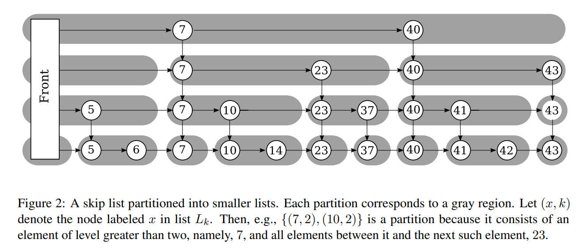

# Learning Augmented Data Structure

<center>图: B-skip list</center>

本项目在倾斜数据集、动态访问热点分布的场景下，针对现有的学习增强型跳表无法根据访问热点的动态变化进行调整、无法感知底层数据分布等问题进行优化，进一步完善了不破坏原有复杂度的插入、删除算法与自适应热点分布算法，并根据现代CPU的缓存特性对学习增强型跳表的节点进行分块化，在块结构内部引入线性模型对底层数据分布进行拟合，大幅提高了查询性能与吞吐量；此外，本项目还基于RobustSL 提出了一种具有最优动态一致性和最优鲁棒性的自适应学习增强跳表，使用牛顿冷却定律实现了实时的热点捕获，在数据访问倾斜的场景下性能显著由于普通跳表，最高可达2.13倍性能提升。

----


# History Log


- sketch usage:
  - 若对某键key访问count次，需要将访问频率更新至sketch中：`sketch.update(key, count)`
  - 若需要得到某键key的预测频率（非归一化）：`sketch.estimate(key)`
  - 若需要得到总访问次数：`sketch.totalcount()`

- Top K usage:

  - 若需要尝试将访问频率为f（归一化）的key加入到Top K中：`topK.add(key, f)`  (add函数内部已考虑与堆顶元素的频率大小比较)
  - 若需要从Top K中获取某key的频率：`topK.getFreq(key)`
  

- 结构示意图

*****SkipList*****

Level0:   0;1;2;3;4;5;6;7;8;9;10;11;12;13;14;15;16;17;18;19;852;854;856;858;860;

Level1:   11;15;19;

Level2:   15;

*****Block Structure of SkipList*****

Level 0:   [7683896064, 0, 1, 2, 3, 4, 5, 6, 7, 8, 9, 10] -> [11, 12, 13, 14] -> [15, 16, 17, 18] -> [19, 852, 854, 856, 858, 860]

Level 1:   [7683896064, 11] -> [15, 19]

Level 2:   [7683896064, 15]


- 可以通俗的理解为：level 1的 3个node，把level 0 的链表分割为 3+1=4个Block

- level 2的 1个node，把level 1 的链表分割为 1+1=2个Block


#### 测试参数说明 

- SkipList 新增构造函数 SkipList<K,V>::SkipList(int maxlevel, int k_of_thresholds, int k_of_getlevel)
-   其中 maxlevel为最大层数  
-   k_of_thresholds,用在bulkload中初始化数组 key_of_thresholds,控制因为出现概率而提升level的节点的阈值
```
    for (int i = 0; i <= _max_level; i ++)
    
    {
    
        double p_threshold = ((1ul << i * key_of_thresholds) - 1.0) / _element_count;
    
        p_thresholds.push_back(p_threshold);

    }
```
-   k_of_getlevel用于get_random_level中,可以一定程度上控制block的大小,key_of_getlevel越大,节点向上提升level的概率越低
```
    if (p >= p_thresholds[level + 1] || !(std::rand() % key_of_getlevel) )
    
            level ++;
```
#### 测试结果

| _max_level | key_of_thresholds | key_of_getlevel | Net throughput |
| ---------- | ----------------- | --------------- | -------------- |
| 16         | 2                 | 16              | 2.8            |
| 16         | 2                 | 32              | 2.7            |
| 16         | 2                 | 64              | 3.0            |
| 32         | 2                 | 16              | 1.85           |
| 32         | 1                 | 32              | 2.0            |
| 32         | 1                 | 64              | 1.95           |
| 8          | 2                 | 64              | 3.34           |
| 3          | 4                 | 64              | 3.8            |

参考LAskiplist的Net throughput大概为1.8

#### 测试方式
cd wiscer
make bskiplist    #或者选择其他在makefile中的结构
./benchmark.out workloads/test 

修改bskiplist参数进行测试需要修改/wiscer/competitors/bskiplist.cpp中的构造函数

```

BskipList::BskipList()

    : skiplist(3,4, 64)  // 分别为 maxlevel；key_of_thresholds; key_of_getlevel;

{

    this->cardinality = 0;

    std::cout << "Data Structure: B-Skiplist " << std::endl;

}
```